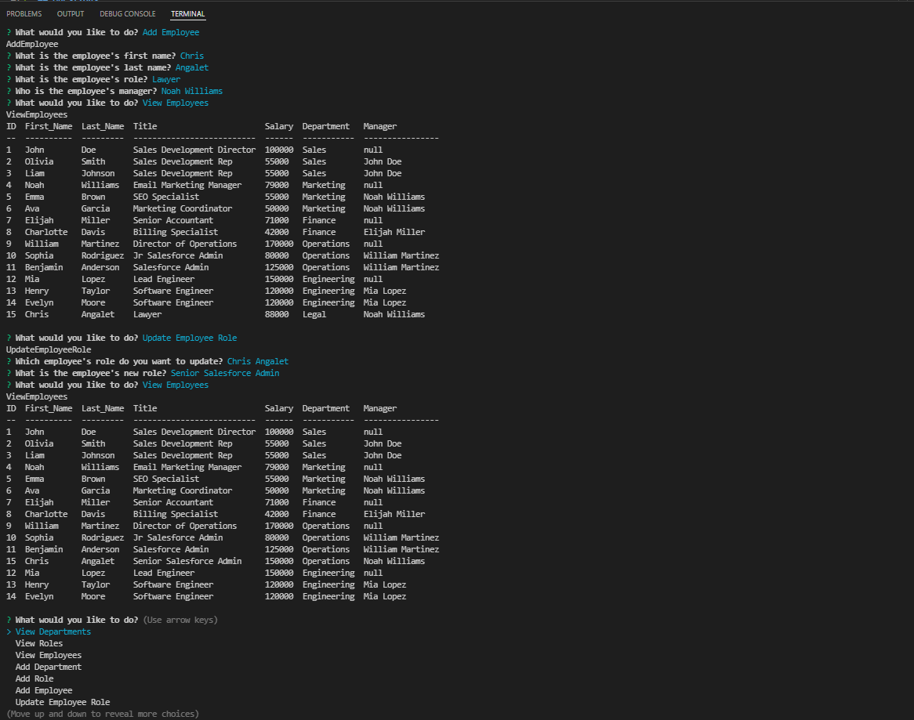

# CHLG-Employee-Tracker

_You can access more badges and their purposes at [shields.io](https://shields.io)_

## Description:

This application is a CLI app to manage a company's employee database, using Node.js, Inquirer, and MySQL.

----------------------------------

## Table of Contents:
- [Description](#description)
- [Installation](#installation)
- [Usage](#usage)
- [License](#license)
- [Questions](#questions)

----------------------------------

## Installation:

_Follow these steps to properly install this application:_

Download the repo from Github.  Run npm install for the following dependencies in your CLI, inquirer, fs, and util.

## Usage:

- Open terminal
- Run "npm start" in the CLI
- Follow the prompts provided to view departments, roles, or empoloyees.  Or add a department, role, employee.  Lastly as an end user you are able to update an employee's role

 [Walkthrough video](https://watch.screencastify.com/v/U6wEVYKIIfudGfv1QpRT)

## License:

NOTICE: This application is covered by [MIT License](https://choosealicense.com/licenses/mit/).

## Questions:

- Github: [cangalet](https://github.com/cangalet)
- Email:  cangalet@gmail.com